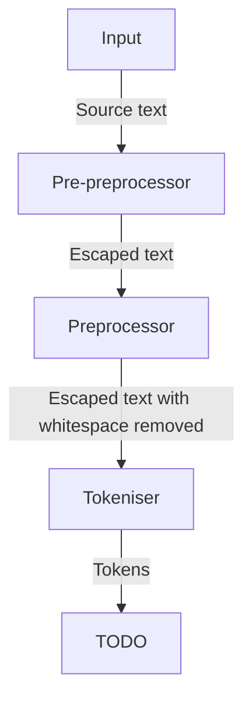

# Carrot

### How it works

```mermaid
flowchart TD
    I[Input]
    --> |Source text| PPP[Pre-preprocessor]
    --> |Escaped text| PP[Preprocessor]
    --> |Escaped text with whitespace removed| T[Tokeniser]
    --> |Tokens| TODO
```